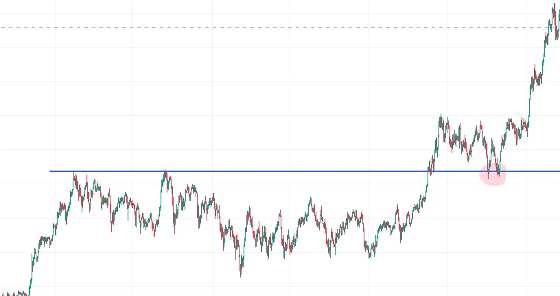

所謂テクニカル分析を揶揄する意で、タイトルのようなことをいう人がたまにいるため、これに関しては容易に説明が可能だなと思ったので記事にしておこうと思います。

実際テクニカル分析をする際は線を引いたり、三角形を書いたり、お絵かきみたいなことをしてることが多いです。これが、つまり過去の値動きを分析してお絵かきすることが、いかにして未来の値動きを予測することにつながるのかを一番簡単と思われる例を用いて説明します。

例えば長期間34ドルと36ドルの間でレンジを作っている株があるとします。テクニカル分析は当然34ドルにサポートのラインをお絵かきし、36ドルにレジスタンスのラインをお絵かきすることになりますよね。その後、34ドルのサポートを抜けて38.8ドルになったとします。このとき、この長期間のレンジの間にロングしたポジションは「全員が含み損」になっていて、その人たちがどういう感情を持っているかは簡単に想像がつくでしょう。

相場には常にざっくり4グループの人間がいます。・買い持ちで相場を監視している人・売り持ちで相場を監視している人・買いで入ろうと思いながら相場を監視しているノーポジの人・売りで入ろうと思いながら相場を監視しているノーポジの人

かなりざっくり単純化してはいますが、この4種類です。「買いでも売りでもないが相場を監視している人」とか「相場を監視していない人」も集合論的にはいるかもしれませんがマーケットに影響を与えないことから無視します。

話を戻すと、34ドルのサポートを抜けたとき、4グループが持つ感情はそれぞれこうです

| 現在のポジション | 狙っていた方向 | 相場認識（ベア勝利） | 次の行動 |
| :--- | :--- | :--- | :--- |
| **買い持ち（ロング）** | — | ベアが勝った | **損切り**（損の拡大を防ぐ） |
| **売り持ち（ショート）** | — | ベアが勝った | **ホールド** または **追撃売り** |
| **ノーポジ** | 買い狙い | ベアが勝った | **静観**（エントリー見送り） |
| **ノーポジ** | 売り狙い | ベアが勝った | **売りでエントリー** |

買いの損切は売りです。4グループのうちの3グループが売りではいることになるため、「ダブルの圧力」がかかっていることになり（トリプルじゃないのかという突っ込みはなしで）、相場はモメンタムをもって1方向に動く局面となるわけです。

この手の「グループ化をしながら感情を読み取りに行く作業」は個人的にはトレードにおいて不可欠な技法だと考えていて、少なくとも、私たちはそこを解き明かすために情報を集めているのだと思っています。ある人はろうそく足から読み取ろうとするかもしれませんし、ある人はFootprint Chartや出来高、オーダーフローを見ているかもしれません。が、見極めたいのは「ダブルの圧力がかかり、価格が一方的に動く場所」なのです。トレーダーは大きく動く時ほど大きく儲かるのですから。

以上の考えを踏まえれば、例えばこのお絵かき、「レジスタンスは抜けた後サポートになる」という性質も説明ができるはずです。まぁ面倒くさくなってきたので一言でいえば、レジスタンスより下にいた間にショートをふっていた、ブレイクアウト後に損をしていたトレーダーが損益分岐点に近づいてきたタイミングで「やれやれ損切」をするため、買いの方向に力を加えることになる。買い場を探していたトレーダーもそれに便乗する形で買いポジをとる。というダブルの圧力となるため、反転しやすい場所となるわけですね。

いかがでしょうか。お絵かきっていうのは過去の値動きに印をつけることで、未来のある時点でそれぞれの立場のトレーダーがどういう感情に駆られてどういうトレードをしがちになるのかを分析すること他ならなず、ひいては勝てるってことが少しわかって貰えたんじゃないかと思います。トレードはポーカーと同じで対戦相手の損失が自分の利益です。敵の性質を知り、それを利用するような行動こそが利益に結び付くと思いませんか？

